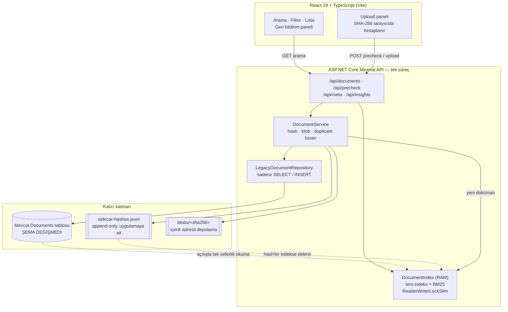
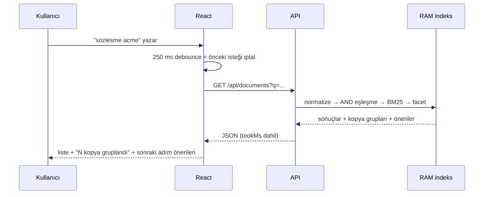

# Doküman Arşivi — Arama ve Duplicate Azaltma

Mevcut doküman yönetim sistemindeki "bulamıyorum / tekrar yüklüyorum / sonuçlar karışık"
geri bildirimlerine, **veritabanı şemasına dokunmadan ve yeni altyapı eklemeden** verilen çalışan bir cevap.

- **Backend:** .NET 10 / ASP.NET Core Minimal API
- **Frontend:** React 19 + TypeScript (Vite)
- **Kalıcı katman:** mevcut (legacy) tablo, olduğu gibi. Yeni türetilmiş veri için tek bir append-only yardımcı dosya.

---

## Hızlı başlangıç

```bash
# 1) Backend (http://localhost:5099) — ilk çalıştırmada demo verisi üretir
dotnet run --project backend/DocArchive.Api --urls http://localhost:5099

# 2a) Frontend, geliştirme modu (http://localhost:5173, /api proxy'li)
cd frontend
npm install
npm run dev

# 2b) veya tek süreçte çalıştır: build çıktısı API'nin wwwroot'una gider
cd frontend && npm run build     # sonra sadece http://localhost:5099 açılır
```

Uçtan uca senaryo testi (API çalışırken):

```powershell
powershell -ExecutionPolicy Bypass -File scripts/smoke-test.ps1
```

23 senaryoyu sırayla çalıştırır: Türkçe katlama, AND davranışı, yazım hatası önerisi,
filtre boşluğu önerileri, hash ile duplicate engelleme, farklı isim–aynı içerik yakalama,
`force` ile bilinçli onay, dosya açma/indirme, PDF-Office-ODF-RTF-HTML içerik çıkarımı,
geriye dönük yeniden indeksleme ve 200 aramalık gecikme ölçümü.

---

## 1) Problemi Yorumlama

### Problemi nasıl tanımlıyorum

Üç geri bildirim üç ayrı problem gibi görünüyor ama tek bir cümleye iniyor:

> **Kullanıcı, bir dokümanın sistemde zaten var olup olmadığını makul bir çabayla doğrulayamıyor.**

Bu, kendi kendini besleyen bir döngü:

```
bulamıyorum → yeniden yüklüyorum → arşivde kopya birikiyor
     ↑                                      ↓
     └──────  sonuçlar daha da karışıyor  ←──┘
```

Kritik nokta: **duplicate hem sonuç hem sebep.** Bulamamanın sonucu olarak oluşuyor, sonra
sonuç listesini kirlettiği için bulamamanın sebebine dönüşüyor. Bu yüzden sadece arama
algoritmasını iyileştirmek döngünün yarısını açık bırakır — üç ay sonra aynı geri bildirimler
gelir, sadece daha fazla dokümanla.

Ayrıca bu bir "arama motoru kalitesi" probleminden çok bir **iş akışı** problemi: sistem,
yükleme anında kullanıcıya "bu zaten var" demiyor. Yani kopya üretmeyi aktif olarak kolaylaştırıyor.

### Gerçek kök neden ne olabilir

Ölçüm görmeden kesin konuşamam; en olası adaylar, en olasıdan başlayarak:

1. **Sıralama yok.** "Sonuçlar çok karışık" ifadesi bir alaka (relevance) sıralaması olmadığının
   klasik göstergesi. Muhtemelen `WHERE FileName LIKE '%x%'` + `ORDER BY Id/CreatedAt` var.
   Kullanıcı 200 sonucun içinde doğru olanın 137. sırada olduğunu bilmiyor.
2. **Tek alanda arama.** Sadece dosya adında aranıyor olabilir; departman, yükleyen kişi,
   tedarikçi adı gibi kullanıcının kafasındaki ipuçları aramaya girmiyor.
3. **Türkçe karakter/normalizasyon yok.** "sozlesme" yazan kullanıcı "Sözleşme" dokümanını bulamıyor.
   Tek satırlık bir kural bu şikayetin kayda değer bir kısmını kapatıyor.
4. **Dosya adlandırmada standart yok.** Asıl bilgi dosya adında ama adlar tutarsız:
   `ACME sözleşme son hali.pdf` ile `acme_sozlesme_FINAL_v2 (1).pdf` aynı dokümandır ve hiçbir
   metin araması bu ikisini güvenle ilişkilendiremez.
5. **Metadata zayıf.** Tür/departman alanları serbest metin veya boş olabilir; öyleyse filtreleme
   kullanıcıya yardım etmek yerine sonuçları rastgele kaybediyor.
6. **Yükleme akışında kontrol adımı yok.** Bu, listedeki tek "arama dışı" madde ve muhtemelen
   duplicate'in birinci sebebi.

### Bu talep yanlış bir varsayıma dayanıyor olabilir mi?

**Evet, iki yerde.**

**Birincisi:** Talep büyük olasılıkla "aramayı güçlendirin" (hatta "Elasticsearch kuralım")
şeklinde geliyor. Ama en iyi arama motoru bile `ACME sözleşme son hali.pdf` ile
`acme_sozlesme_FINAL_v2 (1).pdf` arasındaki ilişkiyi metinden kuramaz — **içerik hash'i bunu
kesin olarak kurar.** Yani problemin bir kısmı arama kalitesi değil, veri kalitesi ve iş akışı.
Bu yüzden yatırımın anlamlı bir kısmını arama yerine **yükleme anına** yaptım.

**İkincisi ve daha önemlisi:** "Kullanıcı arama yapıyor ve bulamıyor" varsayımı. Alternatif
senaryo: kullanıcı aramaya güvenini kaybettiği için **artık arama bile yapmıyor**, doğrudan
yüklüyor. Bu ikisi tamamen farklı çözümler gerektirir:

| Varsayım | Doğruysa yapılması gereken |
|---|---|
| Arıyor, bulamıyor | Arama kalitesi (sıralama, normalizasyon, alan kapsamı) |
| Aramaya güvenmiyor, hiç aramıyor | Yükleme akışına müdahale + güven kazandıran geri bildirim |

Hangisi olduğunu bilmiyorum. Bu yüzden ikisine de **orta boy** bir dokunuş yaptım ve hangisinin
işe yaradığını ölçebilmek için `/api/insights` altına sonuçsuz-arama sayacı ile kopya
istatistiklerini açtım. Birine tüm bütçeyi yatırmak, ölçüm olmadan kumar olurdu.

**Üçüncü, daha sessiz varsayım:** "Son 3 ayda arttı" ifadesi arama davranışının değiştiğini ima
ediyor. Aynı verilerle bambaşka bir açıklama mümkün: 3 ay önce bir departman sisteme taşındı,
doküman sayısı sıçradı ve zaten kırılgan olan arama görünür şekilde bozuldu. Bu doğruysa
problem "arama bozuldu" değil, "arama hiç ölçeklenmemişti".

### Hangi bilgiler eksik

Öncelik sırasıyla — ilk üçü olmadan yapılan her tasarım tahmine dayanır:

1. **Doküman sayısı ve büyüme hızı.** 50 bin mi, 5 milyon mu? Bu tek sayı, RAM içi indeks
   kararının doğru mu yanlış mı olduğunu belirliyor. (Bu prototip ~10⁵ mertebesini varsayıyor.)
2. **Arama telemetrisi.** Sorgu logları, sonuçsuz sorgu oranı, tıklanan sonucun kaçıncı sırada
   olduğu, "aradı → bulamadı → yükledi" dönüşümü. "Sonuçlar karışık" şikayetinin ölçülebilir hali bu.
3. **Duplicate'in gerçek oranı.** Dosyalar üzerinde tek seferlik bir hash taraması bunu bir günde
   söyler. %2 ise bu iş öncelik değil; %20 ise en önemli iş.
4. **Mevcut aramanın gerçekte ne yaptığı.** Hangi alanlar, hangi sorgu, index var mı, sorgu planı ne.
5. **"400 ms" tam olarak ne?** Ortalama mı p95 mi, hangi endpoint, hangi saat dilimi. Ortalama
   400 ms genelde p95'in çok kötü olduğunu saklar.
6. **Dosya içeriklerine erişim.** Hash ve metin çıkarımı için byte'lara ulaşabiliyor muyuz?
   PDF'lerin metin katmanı var mı, yoksa taranmış görüntü mü?
7. **Yetki modeli.** Her kullanıcı her dokümanı görebiliyor mu? Göremiyorsa arama sonuçlarının
   kullanıcı bazlı filtrelenmesi gerekir ve bu, indeksin şeklini baştan değiştirir. **Bu, listedeki
   en riskli bilinmeyen** — geç öğrenilirse mimariyi yeniden yazdırır.
8. **Eşzamanlılık tepe değeri.** 8.000 günlük aktif kullanıcının kaçı aynı anda arıyor?
   Günlük toplam değil, saniyedeki tepe önemli.

---

## 2) Karar ve Tasarım Yaklaşımı

### Seçilen yaklaşım

**Aramayı veritabanının dışına, uygulama sürecinin içine taşıdım; duplicate'i ise kaynağında,
yükleme anında engelledim.**

İki parça:

**(a) RAM içi ters indeks (inverted index) + BM25 sıralama.** Uygulama açılışta legacy tabloyu
bir kez okur, bellekte bir arama indeksi kurar. Aramalar DB'ye hiç gitmez.

Neden bu:

| Kısıt | Bu yaklaşımın cevabı |
|---|---|
| Veritabanı değiştirilemez | Hiç DDL yok. Sadece `SELECT` ve `INSERT`. |
| 3 ay içinde ek altyapı yok | Yeni bileşen yok: Elasticsearch, Redis, ayrı servis, hiçbiri. |
| Response süresi 400 ms'i aşmamalı | Arama yükü DB'den tamamen kalktı. Ölçüm: sunucu içi arama **ortalama 0,13 ms, p95 0,2 ms** (56 doküman). |
| 8.000 günlük aktif kullanıcı | Tek instance için fazlasıyla yeterli; darboğaz DB'den CPU/RAM'e taşındı. |

**(b) İçerik hash'i ile duplicate önleme.** Tarayıcı, dosya seçildiği anda SHA-256 hesaplar ve
`/api/documents/precheck`'e sorar. Byte'lar sunucuya gitmeden kullanıcı "bu zaten var" cevabını alır.
Sunucu, yükleme sırasında hash'i **yeniden hesaplar** (istemciye güvenilmez).

Hash'i legacy tabloya yazamadığımız için doküman→hash eşlemesi append-only bir JSONL dosyasında
(`storage/sidecar-hashes.jsonl`) yaşıyor.

**(c) Dosya içeriğinden metin çıkarımı.** Dosya adı çoğu zaman yetersiz bir ipucu; kullanıcı
"tahkim şartı olan sözleşme" ya da "konsinye maddesi" diye arıyor. Yükleme anında metin çıkarılıp
indeksleniyor; mevcut arşiv için `POST /api/admin/reindex-content` geriye dönük aynı işi yapıyor.

| Biçim | Nasıl | Ek bağımlılık |
|---|---|---|
| PDF (metin katmanlı) | PdfPig — saf .NET, native binary yok | 1 NuGet paketi |
| DOCX / XLSX / PPTX | ZIP+XML: `System.IO.Compression` ile açılıp etiketler sıyrılıyor | **yok** |
| ODT / ODS / ODP | Aynı yol (`content.xml`) | **yok** |
| RTF | Kontrol sözcüğü ayıklayıcı | **yok** |
| HTML / XML / SVG | Etiket sıyırma + HTML entity çözme | **yok** |
| TXT, MD, CSV, JSON, LOG, YAML… | Doğrudan çözümleme; BOM sniff, geçersiz UTF-8'de Windows-1254'e düşer | **yok** |
| Taranmış PDF (metin katmanı yok) | Çıkarılmıyor — "OCR gerekir" olarak etiketlenir | — |
| Eski ikili .doc / .xls | Çıkarılmıyor — "biçim desteklenmiyor" olarak etiketlenir | — |

Kritik ayrıntı: içeriği çıkarılamayan doküman **sessizce eksik davranmıyor**. Sonuç satırında
"içerik aranamıyor" etiketi ve sebebi görünüyor; yükleme cevabında da aynı bilgi veriliyor.
"Yükledim ama içinde arayamıyorum" sürprizini sonradan yaşamak, baştan bilmekten kötü.

**(d) Dokümana tıklayınca açılma.** `GET /api/documents/{id}/file` dosyayı içerik tipiyle
döndürür; tarayıcı PDF/metin/HTML'i sekmede gösterir, Office dosyalarını indirir.
`?download=1` her durumda indirmeye zorlar. Yol veritabanından geldiği için blob kökünün
dışına çıkan her yol reddediliyor (path traversal).

### Mimari



Arama isteği akışı (DB'ye hiç uğramaz):



### Bilerek kabul ettiğim riskler

1. **İndeks RAM'de ve tek süreçte.** İki instance'a çıkıldığı an her instance kendi kopyasını tutar
   (bellek çarpanı) ve bir instance'a yüklenen doküman diğerlerinde görünmez. Kullanıcı yüklediği
   dokümanı bir sonraki isteğinde bulamaz — üstelik sessizce.
   *Neden kabul ettim:* 8.000 günlük aktif kullanıcı tek instance için rahat sınırlar içinde ve
   3 ay bütçesi dağıtık indeks kaldırmıyor. *Çıkış yolu:* **iki kademeli sorgu havuzu** —
   aşağıda 4.1'de açıklanıyor; periyodik yeniden yüklemeden daha iyi bir cevap.

2. **Açılışta tüm tablo okunuyor.** 56 dokümanda 7 ms; lineer büyür. Milyonlarca dokümanda deploy
   başına dakikalar demeye başlar. *Neden kabul ettim:* gerçek doküman sayısı bilinmiyor (bkz. eksik
   bilgi #1). Ölçüldüğünde artımlı/sayfalı yükleme eklenir.

3. **Sidecar dosyası uygulama sunucusunda.** Container yeniden yaratılırsa hash'ler gider.
   Kalıcı veri kaybı değil (dosya byte'larından yeniden üretilebilir) ama duplicate tespiti backfill
   bitene kadar isim benzerliğine düşer. *Bu, çözümün en zayıf noktası — bkz. bölüm 4.3.*

4. **Taranmış belgeler ve eski ikili Office biçimleri aranamıyor.** PDF, OOXML, ODF, RTF, HTML ve
   düz metin ailesinin içeriği indeksleniyor; ama metin katmanı olmayan taranmış PDF'ler OCR
   gerektiriyor ve `.doc`/`.xls` gibi eski ikili biçimler ayrı bir kütüphane istiyor.
   *Neden kabul ettim:* OCR native binary + dil verisi + sayfa başına yüzlerce ms CPU demek;
   upload'ı senkron tutamayız, arka plan kuyruğu şart olur. Bu, "3 ay içinde ek altyapı yok"
   kısıtının açıkça dışında. *Nasıl telafi edildi:* bu dokümanlar sessizce kaybolmuyor,
   "içerik aranamıyor + sebebi" etiketiyle görünüyor ve `/api/insights` kaçının bu durumda
   olduğunu sayıyor — yani boşluğun büyüklüğü ölçülebilir.

7. **İçerik indeksi doküman başına 8.000 karakterle sınırlı.** Uzun bir sözleşmenin sonundaki
   madde aranamayabilir. *Neden kabul ettim:* sınırsız içerik, RAM içi indeks kararını doğrudan
   çökertir (bkz. 4.2). Sınır bilinçli ve tek yerden ayarlanabilir (`ContentExtractor.MaxContentChars`).

8. **Yeniden indeksleme tüm blob'ları okuyor.** 60 dosyada ~270 ms; doküman sayısıyla lineer
   büyür ve tek istekte senkron çalışır. Gerçek sistemde zamanlanmış/parçalı bir iş olması gerekir.

5. **Duplicate tespiti birebir byte eşitliği arıyor.** Aynı sözleşmenin PDF ve DOCX hali ya da tek
   kelimesi değişmiş sürümü farklı hash üretir ve yakalanmaz. İsim benzerliği sinyali bu boşluğu
   kısmen kapatıyor ama kesin değil — bu yüzden **engellemiyor, uyarıyor**.

6. **Yetkilendirme yok.** Prototip kapsamı dışı. Gerçek sistemde doküman bazlı yetki varsa
   indeksin şekli değişir (bkz. eksik bilgi #7).

### Özellikle yapmamayı tercih ettiklerim

- **Elasticsearch / OpenSearch / Redis eklemedim.** Kısıt bunu doğrudan yasaklıyor. Yasaklamasaydı
  bile bu ölçekte, iki ay operasyon öğrenme maliyeti karşılığında kazanılan şey belirsiz.
- **Full-text index (FTS5 / SQL Server FTS) açmadım.** Teknik olarak en zarif cevap bu olurdu; ama
  DB düzeyinde nesne oluşturmak "veritabanı değiştirilemez" kısıtının açık ihlali. Kısıt kalkarsa
  ilk yapılacak iş bu.
- **Sorgu sonucu cache'i (LRU) koymadım.** Aramalar zaten ~0,2 ms. Cache, ölçülebilir bir kazanç
  getirmeden "bayat sonuç" ve "invalidation" diye iki yeni problem eklerdi. Ölçüm gerektirdiğini
  gösterirse eklenir.
- **Embedding / semantik arama kullanmadım.** Maliyet, altyapı ve açıklanabilirlik. Hash zaten en
  net duplicate sinyalini bedavaya veriyor; semantik benzerlik burada çözülen problem değil.
- **OCR (Tesseract) eklemedim.** Native binary + Türkçe dil verisi + arka plan iş kuyruğu
  gerektiriyor; üçü birlikte "ek altyapı yok" kısıtını aşıyor. Ayrıca OCR hata oranı arama
  sonuçlarına gürültü olarak geri döner — ölçmeden eklemek riskli.
- **Office/PDF için ağır bir doküman kütüphanesi (OpenXML SDK, iText vb.) almadım.** OOXML ve ODF
  zaten ZIP+XML; ihtiyacım olan tek şey metin. Tek bir `System.IO.Compression` çağrısıyla
  çözülen problem için paket bağımlılığı eklemek gereksiz yüzey demek.
- **Dosya önizlemesi (gömülü PDF/Office viewer) yapmadım.** Tarayıcının kendi görüntüleyicisi
  PDF, metin ve HTML için zaten yeterli; Office için gömülü viewer harici bir servis gerektirir.
- **Duplicate yüklemeyi sert engellemedim.** Yanlış pozitif tek bir kullanıcıyı işini yapamaz hale
  getirir ve o kullanıcı sistemi tamamen bırakır. "Uyar + bilinçli onay" (`force`) daha doğru bir
  denge; kim, neyi bilerek onayladı bilgisi de loglanıyor.
- **Kimlik doğrulama, versiyonlama, dosya önizleme, OCR, S3/blob servisi:** MVP dışı. Hiçbiri üç
  geri bildirimi doğrudan azaltmıyor.
- **ORM (EF Core) kullanmadım.** `Microsoft.Data.Sqlite` ile düz SQL. Sebep sadece basitlik değil:
  ORM, model değiştirince migration üretme eğilimindedir; burada şemaya dokunmamak bir kural.
  Düz SQL bu kuralı kodun kendisinde görünür kılıyor.

### MVP kapsamını nasıl belirledim

Tek ölçüt: **"Bu madde, üç geri bildirimden en az birini doğrudan azaltıyor mu ve hiçbir kısıtı
ihlal etmiyor mu?"**

| Geri bildirim | MVP'ye giren |
|---|---|
| "Dokümanı bulamıyorum" | Çok alanlı arama (ad + tür + departman + yükleyen + **dosya içeriği**), Türkçe karakter katlaması, yazarken ön-ek eşleşmesi, yazım hatası önerisi, BM25 alaka sıralaması, sonuca tıklayınca dokümanın açılması |
| "Aynı dokümanı tekrar yüklüyorum" | Yükleme öncesi hash kontrolü, birebir kopyada engelleme + bilinçli onay, benzer isim uyarısı, içerik adresli depolama (aynı içerik diske ikinci kez yazılmaz) |
| "Arama sonuçları çok karışık" | Varsayılan AND davranışı, alan ağırlıkları (dosya adı 3× içerik), aynı içerikli kopyaların tek satırda gruplanması, facet'ler, sıralama seçenekleri, boş sonuçta eyleme dönüşebilir öneriler |

Bu tabloya girmeyen her şey v2'ye bırakıldı. Ek olarak `/api/insights` MVP'ye alındı — kendisi bir
kullanıcı talebi değil, ama **çözümün işe yarayıp yaramadığını ölçmenin tek yolu**, ve ölçüm
olmadan bir sonraki kararı yine tahminle vermek zorunda kalırdık.

---

## 3) Çalışan Prototip

### Özellikler

| İstenen | Nerede |
|---|---|
| Doküman listeleme | `GET /api/documents` · sayfalama, 5 sıralama seçeneği |
| Filtreleme / arama | `q`, `type`, `department`, `from`, `to` · facet'ler tıklanabilir · **dosya içeriğinde arama** |
| Kullanıcıya anlamlı geri bildirim | `messages`, `suggestions`, `didYouMean`, `tookMs`, `matchesIgnoringFilters`, `contentNote` |
| Duplicate azaltıcı mekanizma | `POST /api/documents/precheck` → 409 + `force` akışı · içerik adresli blob deposu |
| Dokümanı açma | Sonuç başlığına tıklama → `GET /api/documents/{id}/file` (yeni sekme) · ayrıca "indir" |

### API

| Endpoint | Açıklama |
|---|---|
| `GET /api/documents` | Arama + filtre + sayfalama. Kopya grupları, facet'ler ve öneriler aynı cevapta. |
| `GET /api/documents/{id}` | Tek doküman. |
| `GET /api/documents/{id}/duplicates` | Birebir kopyalar + benzer isimliler. |
| `POST /api/documents/precheck` | `{fileName, sizeBytes, sha256}` → `new` / `similar` / `duplicate`. |
| `POST /api/documents` | Multipart upload. Kopyada **409**, `force=true` ile bilinçli onay. Metin çıkarımı burada yapılır. |
| `GET /api/documents/{id}/file` | Dokümanı açar (`?download=1` indirir). Blob kökü dışındaki yollar reddedilir. |
| `POST /api/admin/reindex-content` | Mevcut arşivi geriye dönük aranabilir yapar: blob'lardan metin çıkarır, **boş** `ContentText` hücrelerini doldurur, indeksi yeniden kurar. |
| `GET /api/meta` | Filtre açılırları için tür/departman/kullanıcı listesi. |
| `GET /api/insights` | Kopya istatistikleri, içeriği aranabilir doküman oranı, sonuçsuz aramalar, indeks metrikleri. |
| `GET /api/health` | Durum + indekslenmiş doküman sayısı. |

> `reindex-content` mevcut şemaya `UPDATE` yazan tek yer. Yeni kolon/tablo/indeks yaratmıyor ve
> **yalnızca boş hücreleri** dolduruyor — dolu hücreye dokunmuyor. Bunu şema değişikliği saymadım;
> upload'ın zaten yaptığı şeyi geçmişe dönük yapıyor. Tartışmaya açık bir yorum olduğunun farkındayım,
> bu yüzden ayrı bir endpoint'te ve açıkça işaretli.

### Ölçülen davranış (`scripts/smoke-test.ps1`, 60 demo dokümanı)

| Senaryo | Sonuç |
|---|---|
| `sozlesme` → `Sözleşme` dokümanları | 26 sonuç, 1,6 ms — Türkçe katlama çalışıyor |
| `acme` | 3 kopya tek satırda gruplandı, 1 sonuç + "2 kopya" etiketi |
| `gamma fatura` (AND) | 1 sonuç — alakasız doküman yok |
| `gamma sigorta` (AND boş) | Kısmi eşleşmeye düşüyor + kullanıcıya açık uyarı |
| `sozlesne` (yazım hatası) | 0 sonuç, `didYouMean: sozlesme` |
| `acme` + departman=Finans | 0 sonuç ama "filtresiz 3 sonuç var" + 3 tıklanabilir öneri |
| Aynı dosyayı tekrar yükleme | **409**, hangi doküman/kim/ne zaman bilgisiyle |
| Farklı isim, aynı içerik | **409** — hash yakalıyor, isim benzerliği gerekmiyor |
| `force=true` | 201, "kopya olduğu bilinerek onaylandı" olarak kaydedilir |
| Dokümana tıklama | 200 + doğru içerik tipi; PDF imzası `%PDF`, OOXML/ODF imzası `PK` |
| `?download=1` | `attachment` + Türkçe dosya adı için RFC 5987 kodlaması |
| 200 arama gecikmesi | sunucu içi **ort. 0,08–0,18 ms · p95 0,15–0,29 ms** |
| İndeks kurulumu | 60 doküman / 9 ms |

İçerik araması, reindex öncesi/sonrası ölçümüyle:

| Sorgu | Kelime nerede | Önce | Sonra | Bulunan |
|---|---|---|---|---|
| `tahkim` | PDF içeriği | 0 | **1** | Delta_Enerji_Cerceve_Sozlesmesi.pdf |
| `depozito` | PDF içeriği | 0 | **1** | Ofis_Kira_Sozlesmesi_2024.pdf |
| `teminat` | RTF içeriği | 1 | 1 | Ihale_Sartnamesi_Ozet.rtf |
| `mucbir` | ODT içeriği | 1 | 1 | Cerceve_Sozlesme_Sablonu.odt |
| `komitesi` | HTML içeriği | 1 | 1 | Toplanti_Notlari_Tedarik_Komitesi.html |
| `dizustu` | XLSX içeriği | 1 | 1 | IT_Donanim_Alim_Teklifi.xlsx |
| `katilimci` | DOCX içeriği | 1 | 1 | Personel_Egitim_Hizmeti_Teklifi.docx |

`reindex-content`: 60 doküman tarandı → 4 PDF'in metni çıkarıldı, 2 taranmış PDF "metin katmanı yok"
olarak işaretlendi, 1 eski `.doc` "biçim desteklenmiyor" dedi, 271 ms. İçeriği aranabilir doküman
oranı 53/60 → 57/60'a çıktı; kalan 3'ün her biri sebebiyle birlikte etiketli.

Demo verisi bilinçli olarak "kirli" ve **dosyaları gerçek**: üç farklı isimle yüklenmiş aynı ACME
sözleşmesi (byte'ları birebir aynı, kopya grubu gerçek hash eşitliğinden doğuyor), `_imzali` ekiyle
tekrarlanmış fatura, `kopya` ekli teklif, **hash'i olmayan iki taranmış PDF** (metin katmanı yok →
duplicate tespiti isim benzerliğine, içerik araması OCR'a düşer), içeriği hiç çıkarılmamış 4 PDF ve
bir eski ikili `.doc`. Dosyalar `DemoFileFactory` tarafından uzantısıyla uyumlu olarak üretiliyor:
elle yazılmış minimal PDF (doğru xref tablosuyla), gerçek OOXML/ODF paketleri, RTF ve HTML.

---

## 4) Teknik Değerlendirme

### 4.1 Bu çözüm 6 ay sonra neden problem çıkarabilir?

**En muhtemel sebep, tek instance varsayımının çökmesi.** 6 ay içinde uygulama büyük olasılıkla
ikinci bir instance'a çıkar (yük, HA, ya da sadece rolling deploy). O an indeks tutarsızlığı
kullanıcıya şöyle görünür: *dokümanı yükledim, sayfayı yeniledim, yok.* Bu, hata mesajı vermeyen,
bug olarak raporlanması zor, güveni doğrudan yıkan bir davranış — yani düzeltmesi teknik olarak
kolay ama fark edilmesi zor bir sorun.

Ve etkisi yalnızca "rahatsız edici" değil, **çözdüğümüz problemi geri getiriyor**: kullanıcı
yüklediğini bulamayınca sistemin çalışmadığını sanıp yeniden yükler. Yani indeksleme gecikmesi,
azaltmaya çalıştığımız duplicate'i yeniden üretir.

**Çözüm: iki kademeli sorgu havuzu.** Taze yüklenen kayıtlar, ana indekse işlenene kadar küçük bir
ön havuzda barındırılır. Sorgu **önce bu havuza** bakar (küçük olduğu için maliyeti düşük), ardından
zaten var olan garanti veri havuzundan diğer sonuçları getirip birleştirir. Böylece indeksleme
mekanizmalarının en büyük dezavantajı olan **insert gecikmesi minimize edilir** — kullanıcı
yüklediği dokümanı bir sonraki aramada görür, ana havuz arkada güncellenir.

Bu, "60 saniyede bir indeksi baştan kur" yaklaşımından belirgin şekilde iyi: yeniden kurulum
O(N) maliyetli ve gecikmeyi ortalama 30 saniyeye indirirken, ön havuz gecikmeyi **sıfıra**
indiriyor ve maliyeti yüklenen doküman sayısıyla sınırlı.

**İkinci sebep, açılış maliyetinin lineer büyümesi.** Bugün 7 ms olan indeks kurulumu, doküman
sayısıyla doğru orantılı artıyor. Deploy sıklığı arttıkça (ki artar) her deploy'da tüm tabloyu
okumak hem yavaşlar hem DB'ye periyodik bir yük bindirir.

**Üçüncüsü, indeksin bakımsız büyümesi.** Bugün silme/güncelleme akışı yok. Eklendiği anda ters
indeksin tombstone yönetimi gerekir; yoksa silinmiş dokümanlar arama sonuçlarında görünmeye devam eder.
`reindex-content` şu an bu yüzden indeksi baştan kuruyor — nadir çalıştığı için kabul edilebilir,
ama sık çalışması gerekirse bu yaklaşım tutmaz.

**Dördüncüsü, içerik indeksinin sessiz büyümesi.** Doküman başına 8.000 karakter indeksliyoruz.
Bu, dosya adı-only indekse kıyasla token sayısını kabaca 10–20 kat büyütüyor. Bugün 60 dokümanda
360 terim; yüz binlerce dokümanda ters indeks belleğin baskın tüketicisi olur ve kimse bunu
bir tasarım kararı olarak hatırlamıyor olacak.

### 4.2 10.000 kullanıcıya ölçeklendiğinde ilk kırılacak nokta neresi olur?

8.000 → 10.000 farkı tek başına hiçbir şeyi kırmaz (%25 artış, aramalar 0,2 ms). Kıran şey
kullanıcı sayısı değil, onunla birlikte gelen **doküman sayısı ve upload frekansı** olur.

**İlk kırılacak yer: upload yolundaki `DocumentIndex.FindSimilar`.** Bu metot her upload'da
**tüm dokümanları tek tek dolaşıyor** (O(N)) ve her doküman için `Intersect` çağırdığı için
**doküman başına bir `HashSet` ayırıyor** — yani upload başına N tahsis.

Mekanizmayı doğru kurmak önemli: okuma kilidi paylaşımlı olduğundan `FindSimilar` aramaları
doğrudan **bloklamıyor**. Zincir dolaylı: yükleme sonunda `index.Add()` özel yazma kilidi
istiyor, `ReaderWriterLockSlim` yazar açlığını önlemek için bekleyen bir yazar varken yeni
okuyucuları sıraya alıyor → **konvoy etkisi**. Buna doküman başına HashSet çöpünün getirdiği
sürekli GC baskısı ekleniyor. Sonuç: yavaşlayan şey upload değil, **arama** olur — yani teşhisi
yanıltıcı bir darboğaz.

Kırılma sırası:

1. `FindSimilar` / upload yolu (O(N) tarama + upload başına N tahsis + yazma kilidi konvoyu)
2. **RAM** — iki kalem: doküman metadata + 800 karakterlik snippet (~2 KB/doküman) **ve** içerik
   token'larıyla şişen ters indeks (~7–12 KB/doküman). İçerik indekslemesi ikinci kalemi baskın
   hale getirdi: 8.000 karakterlik metinden ~450 tekil token çıkıyor, dosya adı-only durumdan
   onlarca kat fazla. **Toplam ~10–15 KB/doküman → pratik tavan ~100 bin doküman** (1–1,5 GB).
   500 binde 5–7 GB; tek süreçte tutulamaz. Bu, RAM içi indeks kararının gerçek sınırı.
3. **`reindex-content`** — tüm blob'ları senkron okuyup metin çıkarıyor. 60 dosyada 271 ms;
   yüz binlerce dosyada tek istekte çalışamaz, parçalanması gerekir.
4. **Açılış süresi** — deploy başına tüm tabloyu okuma (artık her satırda içerik metni de var,
   yani okunan veri hacmi de büyüdü)
5. **Veritabanı** — en son, çünkü arama yükünü ondan aldık (ironik biçimde en sağlam yer o oldu)

`FindSimilar`'ın çözümü de pahalı değil: isim imzası token'larından ters bir arama sözlüğü tutmak
taramayı O(N)'den aday kümesine indirir. Bugün yapmadım çünkü mevcut ölçekte ölçülebilir bir
etkisi yok ve gereksiz karmaşıklık olurdu.

### 4.3 En zayıf gördüğüm teknik kararım nedir?

**İçerik hash'lerini uygulama sunucusundaki bir JSONL dosyasında tutmak.**

Kısıta uyuyor (DB'ye dokunmuyor) ama kritik bir veriyi, ömrü kısa olan bir yere bağlıyor:
container yeniden yaratma, çok instance, disk sıfırlama — hepsi tamamen normal operasyonel
olaylar ve hepsi bu dosyayı kırıyor. Duplicate tespitinin **tek güvenilir sinyali** bu dosyada.

Doğru yer, kısıt izin verseydi, legacy şemaya dokunmayan tek bir yardımcı tablo olurdu; kısıt
kalkmayacaksa en azından paylaşımlı bir depolama. Bilinçli olarak sistemin en kırılgan parçasını
buraya koydum ve karşılığında **yeniden üretilebilir** tuttum: dosya byte'ları elimizde olduğu için
bir backfill işi hash'leri sıfırdan hesaplayabilir. Yani kayıp = geçici yetenek kaybı, kalıcı veri
kaybı değil. Ama "yeniden üretilebilir" olması, "kırılgan olmadığı" anlamına gelmiyor.

### 4.4 Bu çözümde beni en rahatsız eden teknik nokta nedir?

**Aramanın doğruluğunu ölçen hiçbir mekanizmanın olmaması.**

Sistemin içinde veriyle doğrulanmamış bir dizi sayı var:

- alan ağırlıkları: dosya adı 3,0 · tür 2,0 · departman 1,5 · içerik 1,0
- ön-ek eşleşmesi katsayısı 0,6
- BM25 `k1 = 1.2`, `b = 0.75` (literatür varsayılanı, bu korpus için ayarlanmadı)
- isim benzerliği eşikleri 0,5 / 0,6 · boyut yakınlığı bonusu 0,25
- yenilik (recency) çarpanı `1 + 0.2 · e^(-yaş/365)`

Hepsi savunulabilir tahminler; **hiçbiri ölçüm sonucu değil.** Yani "arama sonuçları çok karışık"
şikayetini, kullanıcı verisiyle değil kendi sezgimle değiştirdim. Sonuçların gerçekten daha iyi
olduğunu bilmiyorum — sadece daha savunulabilir olduğunu biliyorum.

`/api/insights` altındaki sonuçsuz-arama sayacı bu boşluğun sadece kenarını kapatıyor.
Gerçekten gereken şey tıklama pozisyonu telemetrisi (kullanıcı kaçıncı sonuca tıklıyor?) ve
öncesi/sonrası karşılaştırması. Bu ölçüm devreye girene kadar, bu çözümün doğru çözüm olduğu
bir hipotez olarak kalıyor.

İçerik araması eklendikten sonra bu rahatsızlık büyüdü: artık içerik alanının ağırlığı (1,0) ile
dosya adının ağırlığı (3,0) arasındaki oran, "içeriğinde geçen doküman mı, adında geçen doküman mı
önce gelsin" sorusunu benim adıma cevaplıyor. Uzun bir sözleşmenin içinde bir kez geçen kelime ile
dosya adında geçen kelimenin göreli değerini bilmiyorum — BM25'in uzunluk normalizasyonu bunu
kısmen düzeltiyor ama doğrulanmadı.

İkinci sırada rahatsız eden şey: `DocumentIndex` sınıfının fazla çok işi olması — indeksleme,
skorlama, filtreleme, facet, kopya gruplama ve kullanıcı mesajı üretimi aynı sınıfta. Tek yerde
durması bu boyutta okumayı kolaylaştırıyor, ama arama mantığı ile kullanıcıya dönük metin üretimi
aynı sınıfta olmamalı; büyüyen ilk yer burası olacak.

Üçüncüsü, `DemoFileFactory` içindeki elle yazılmış PDF üreteci. Demo için gerekliydi (dosya olmadan
ne tıklama ne içerik araması gösterilebilirdi) ve doğru çalışıyor, ama bir prototipte kendi PDF
yazıcısını taşımak hoş değil — gerçek kurulumda tamamen silinecek bir kod.

---

---

## 5) İletişim

### 5.1 İş Birimine Açıklama

**Konu: Doküman arama ve mükerrer yükleme sorunu — ne değişiyor**

Son üç aydır gelen üç şikayetin — *"bulamıyorum"*, *"tekrar yüklüyorum"*, *"sonuçlar karışık"* —
aslında tek bir sorunun üç yüzü olduğunu gördük: **bir dokümanın sistemde zaten var olup
olmadığını makul bir sürede anlayamıyorsunuz.** Bulamayınca yeniden yüklüyorsunuz, yeniden
yükledikçe arşiv karışıyor, karıştıkça bulmak daha da zorlaşıyor. Kendi kendini besleyen bir kısır
döngü. Bu yüzden hem aramayı hem de yükleme adımını birlikte ele aldık.

**Kullanıcı için ne değişiyor**

- **Aynı dokümanı ikinci kez yüklemeye çalıştığınızda sistem sizi durduruyor** ve "bu doküman
  şurada, şu tarihte, şu kişi tarafından yüklenmiş" diyor. Dosyanın adını değiştirmiş olsanız
  bile tanıyor, çünkü ada değil dosyanın kendisine bakıyor. Gerçekten ikinci bir kopya
  gerekiyorsa "yine de yükle" ile devam edebiliyorsunuz — engellemiyor, uyarıyor.
- **Arama artık dokümanın içine de bakıyor.** Sadece dosya adını değil; sözleşmenin, teklifin,
  faturanın metnini de tarıyor. "Tahkim şartı olan sözleşme" ya da "konsinye maddesi" diye
  arayabiliyorsunuz.
- **Türkçe yazım artık engel değil.** "sozlesme" yazsanız da "Sözleşme" dokümanlarını buluyor.
  Yazım hatası yaptığınızda "şunu mu demek istediniz?" diye öneriyor.
- **Sonuçlar en alakalıdan sıralanıyor**, tarih sırasına göre değil. Aynı dokümanın kopyaları tek
  satırda toplanıyor, liste 5 kopyayla şişmiyor.
- **Sonuç bulunamadığında ne yapacağınızı söylüyor.** "Bu filtrelerle sonuç yok ama filtresiz 3
  sonuç var" gibi — tek tıkla düzeltebiliyorsunuz.
- **Sonuca tıklayınca doküman açılıyor.** İndirmek için ayrıca bir bağlantı var.

**Bunun için ne gerekmedi**

Yeni bir program satın alınmadı, mevcut sisteme yeni bir sunucu eklenmedi, kullanılan
veritabanı değiştirilmedi. Arama hızı düşmedi — aksine arttı, çünkü arama yükü veritabanının
üzerinden alındı.

**Neyi çözmüyor — bunu baştan bilmenizi istiyoruz**

- **Fotokopi/tarama ile alınmış belgelerin içi aranamıyor.** Bu belgelerde metin yok, sadece
  görüntü var; içini okumak ayrı bir teknoloji (OCR) gerektiriyor ve bu aşamada kapsam dışı.
  Bu belgeler kaybolmuyor, dosya adıyla bulunuyorlar ve listede "içerik aranamıyor" etiketiyle
  görünüyorlar — yani neyi aramadığınızı biliyorsunuz.
- **Çok eski Word/Excel dosyaları** (2007 öncesi biçim) aynı şekilde yalnızca adıyla bulunuyor.
- **Birebir aynı olmayan kopyalar** yakalanmıyor. Bir kelimesi değişmiş ya da PDF'i Word'e
  çevrilmiş bir sürüm sistem için farklı bir dokümandır. Bu durumda "benzer isimli doküman var"
  uyarısı veriliyor ama kararı siz veriyorsunuz.

**İşe yarayıp yaramadığını nasıl ölçeceğiz**

Sistem artık kaç mükerrer yüklemenin engellendiğini, arşivde kaç kopya grubu olduğunu ve hangi
aramaların hiç sonuç döndürmediğini sayıyor. Bu son kalem en değerlisi: kullanıcıların arayıp
bulamadığı kelimeleri görebileceğiz ve bir sonraki iyileştirmeyi tahminle değil bu listeye
bakarak yapacağız.

---

### 5.2 CTO'ya Teknik Özet

**Ne yapıldı**

Arama yükü veritabanından alınıp uygulama sürecine taşındı: açılışta legacy `Documents` tablosu
bir kez okunuyor, RAM'de ters indeks (inverted index) + BM25 sıralaması kuruluyor, aramalar
veritabanına hiç gitmiyor. Duplicate ise kaynağında engelleniyor: SHA-256 içerik hash'i,
yüklemeden önce tarayıcıda hesaplanıp sorguluyor, sunucu yükleme anında yeniden doğruluyor.
İçerik metni PDF (PdfPig), OOXML/OpenDocument (ZIP+XML, ek bağımlılık yok), RTF, HTML ve düz
metin ailesinden çıkarılıp indeksleniyor.

Şema değişikliği yok. Yeni bileşen yok. Ölçülen sonuç: **arama p95 0,24 ms** (hedef 400 ms),
indeks kurulumu 60 dokümanda 9 ms.

**Temel takas**

Kısıtlar (DB dondu, 3 ay, ek altyapı yok) tek bir yolu açık bırakıyordu: arama indeksini
uygulama sürecinin belleğinde tutmak. Bu, response süresi problemini kesin olarak çözüyor ama
**ölçek ve dayanıklılık borcunu peşin olarak alıyor.** Aşağıdaki liste o borcun envanteri.

**Teknik borç — öncelik sırasına göre**

| # | Borç | Ne zaman patlar | Etkisi | Çözüm |
|---|---|---|---|---|
| 1 | **Tek instance varsayımı.** Her instance kendi RAM indeksini tutar; bir instance'a yüklenen doküman diğerinde görünmez. | İkinci instance açıldığı gün | **Sessiz veri görünmezliği** — hata mesajı yok, kullanıcı yüklediğini bulamaz, sistemin çalışmadığını sanıp yeniden yükler. Yani azaltmaya çalıştığımız duplicate'i indeksleme gecikmesi yeniden üretir. Listedeki en tehlikeli madde. | **İki kademeli sorgu havuzu**: taze kayıtlar ana indekse işlenene kadar küçük bir ön havuzda tutulur, sorgu önce oraya bakar (düşük maliyet), sonucu garanti havuzla birleştirir → insert gecikmesi sıfırlanır. Kalıcı çözüm: diskte paylaşımlı indeks. Ayrıntı §4.1. |
| 2 | **`FindSimilar` O(N) + doküman başına `HashSet` ayırıyor** (`Intersect`). Upload başına N tahsis. | ~50–100 bin doküman | Sürekli GC baskısı; bekleyen yazma kilidi üzerinden arama p95'ine konvoy etkisi. | İsim imzası token'ları üzerinden ters indeks → O(aday). Yarım günlük iş. |
| 3 | **Açılışta O(N) yeniden kurulum.** Ölçüm: 150 µs/doküman (kısa içerik), gerçekçi tahmin ~2 ms/doküman (8.000 karakter içerik). | 1M dokümanda ~33 dk | Deploy başına kesinti; çökme sonrası kurtarma süresi. | Artımlı/sayfalı yükleme, ya da kalıcı indeks. |
| 4 | **Sidecar hash dosyası uygulama sunucusunun diskinde.** | Container yeniden yaratıldığında | Kalıcı veri kaybı değil (blob'lardan backfill edilebilir), ama duplicate tespiti backfill bitene kadar isim benzerliğine düşer. Çok sunucuda paylaşılamaz. | Şemaya dokunmayan tek yardımcı tablo (DDL gerekir) veya paylaşımlı depolama. |
| 5 | **Arama kalitesini ölçen hiçbir mekanizma yok.** Alan ağırlıkları (3.0/2.0/1.5/1.0), BM25 `k1=1.2`/`b=0.75`, ön-ek katsayısı 0.6, benzerlik eşikleri 0.5/0.6 — hepsi doğrulanmamış tahmin. | Zaten var | "Sonuçlar karışık" şikayetini kullanıcı verisiyle değil sezgiyle değiştirdik. İyileşme hipotez. | Tıklama pozisyonu telemetrisi + öncesi/sonrası karşılaştırma. Sonuçsuz-arama sayacı bu boşluğun sadece kenarı. |
| 6 | **Blob dizini düz.** `blobs/{sha256}{ext}`, tek klasör. | ~1M dosya | Yedekleme, tarama, antivirüs ve dizin listeleme çöker. | Hash ön ekiyle bölme (`ab/cd/...`). Bir saatlik iş. |
| 7 | **Kimlik doğrulama yok.** `reindex-content` endpoint'i korumasız, `uploadedBy` istemciden geliyor. | Üretime çıkışta | Yetkisiz erişim / sahte atıf. | Prototip kapsamı dışı bırakıldı; üretim öncesi zorunlu. |
| 8 | **`ContentText` kolonuna `UPDATE`.** Sadece boş hücreleri dolduruyor, DDL yok — ama yine de mevcut şemaya yazıyor. | — | "Veritabanı değiştirilemez" kısıtının benim yorumu. **Onay gerektirir.** | Kısıt katıysa içerik metnini de sidecar'a taşımak gerekir. |
| 9 | **BM25F değil, "birleşik sahte doküman" üzerinde BM25.** Tüm alanlar tek `doc.Length` paylaşıyor. | Zaten var | Uzun içerikli bir dokümanın *dosya adındaki* eşleşmesi, içerik uzunluğu yüzünden cezalandırılıyor. Muhtemelen yanlış, ölçülmedi. | Alan bazlı uzunluk normalizasyonu (gerçek BM25F). |

**Kapasite — düzeltilmiş tahmin**

| Doküman | Tahmini RAM | Durum |
|---|---|---|
| 10.000 | ~100–150 MB | Rahat |
| 50.000 | ~500–750 MB | Çalışır |
| **~100.000** | **~1–1,5 GB** | **Pratik tavan** |
| 500.000 | ~5–7 GB | Tek instance'ta tutmaz |

Doküman başına 10–15 KB (metadata ~600 B + 800 karakter snippet ~1,6 KB + içerik postings ~7–12 KB).
Bu tahmin ölçülmedi, hesaplandı; 100 bin sentetik dokümanla doğrulanması gerekiyor.

**Donanımla çözülmez.** 128 GB RAM, doküman tavanını 8M'a çıkarır ama açılış süresini 4,5 saate
yükseltir, `FindSimilar` maliyetini 80 kat büyütür, 100 GB'lık managed heap'te gen2 GC
duraklamaları 400 ms bütçesini yer ve tek instance/HA problemine hiç dokunmaz. Sorun bellek
miktarı değil, indeksin bellekte ve geçici olması.

**Karar gerektiren nokta**

Bu tasarım *"8.000 aktif kullanıcı"* için ölçüldü ve o çerçevede sağlam. Ama **günlük upload
hacmi** brief'te belirtilmemiş. Eğer günde binlerce doküman yükleniyorsa (örn. 8.000/gün =
176.000/ay) pratik tavan **2,5 haftada** aşılır ve üç seçenekten biri şimdi seçilmelidir:

| Seçenek | Bedeli | Kısıtlara uyum |
|---|---|---|
| **A.** İçeriği RAM'de indekslemeyi bırak (yalnızca ad + metadata) | 15 KB → 1,5 KB/doküman, tavan 1M'a çıkar. **Bedeli: içerik aramasından vazgeçmek.** | ✅ Tam uyumlu |
| **B.** Lucene.NET — diskte kalıcı, memory-mapped indeks | Milyonlarca doküman, açılışta yeniden kurulum yok, GC problemi yok. Kütüphane, sunucu değil. | ✅ Kütüphane olduğu için "ek altyapı" sayılmaz |
| **C.** Veritabanının kendi full-text özelliği (SQL Server FTS / PostgreSQL GIN) | En ucuz doğru cevap, işletme yükü sıfır. | ❌ DDL gerekir — kısıt gevşemeli |

Önerim **B**. Kritik nokta: BM25 sıralaması, Türkçe katlama, AND davranışı, kopya gruplama,
geri bildirim önerileri — hiçbiri RAM'e bağlı değil, hepsi taşınabilir mantık. İndeksi Lucene'e
almak yapılan işin hiçbirini çöpe atmaz; yalnızca `_inverted` sözlüğünün yerini değiştirir.

**Netleşmesini istediğim dört bilgi**

1. Mevcut doküman sayısı ve günlük yükleme hacmi (tüm kapasite tartışması buna bağlı)
2. Veritabanı ürünü — SQL Server/PostgreSQL ise Seçenek C masada
3. **Doküman bazlı yetkilendirme var mı** — varsa arama sonuçlarının kullanıcıya göre
   filtrelenmesi gerekir ve bu indeksin şeklini baştan değiştirir. Listedeki en riskli bilinmeyen.
4. "400 ms" ortalama mı p95 mi — ortalama 400 ms genelde çok kötü bir p95'i saklar

---

## Proje yapısı

```
backend/DocArchive.Api/
  Program.cs                        API endpoint'leri, DI, açılışta indeks kurulumu
  Search/DocumentIndex.cs           Ters indeks, BM25, facet, kopya gruplama, öneriler
  Search/TextNormalizer.cs          Türkçe katlama, tokenizasyon, isim imzası, edit distance
  Services/ContentExtractor.cs      PDF / OOXML / ODF / RTF / HTML / düz metin → aranabilir metin
  Services/DocumentService.cs       Upload akışı, duplicate kararı, reindex, dosya çözümleme
  Data/LegacyDocumentRepository.cs  Mevcut tablo erişimi (SELECT / INSERT + boş hücre UPDATE)
  Data/SidecarHashStore.cs          Doküman → SHA-256 eşlemesi (append-only JSONL)
  Data/DemoDataBootstrapper.cs      SADECE DEMO — mevcut sistemi taklit eden örnek veri
  Data/DemoFileFactory.cs           SADECE DEMO — uzantısıyla uyumlu gerçek dosya üretimi
  Models/Contracts.cs               İstek/cevap sözleşmeleri
frontend/src/
  App.tsx                           Durum yönetimi, debounce, istek iptali
  api.ts                            API çağrıları + tarayıcıda SHA-256 + dosya adresleri
  components/UploadPanel.tsx        Yükleme öncesi kopya kontrolü akışı
  components/FeedbackPanel.tsx      Mesajlar, öneriler, "şunu mu demek istediniz"
  components/DocumentList.tsx       Sonuç listesi, dokümanı açma, kopya grupları, vurgulama
  components/FilterBar.tsx          Filtreler + tıklanabilir facet'ler
  components/InsightsBar.tsx        Göstergeler + geriye dönük içerik çıkarımı butonu
scripts/smoke-test.ps1              23 senaryoluk uçtan uca test
```

## Notlar

- `Legacy:BootstrapDemoData` gerçek kurulumda `false` yapılmalıdır. `true` iken *yalnızca* demo
  için boş bir SQLite şeması oluşturur; çözümün çalışan yolları hiçbir yerde DDL çalıştırmaz.
- Prototip SQLite kullanıyor. Gerçek sistemde `LegacyDocumentRepository` içindeki bağlantı ve
  `Documents` tablosu adı/kolonları hedef veritabanına göre değiştirilir; başka hiçbir yer etkilenmez.
- Upload boyutu 25 MB ile sınırlı — hash bellekte hesaplandığı için sınırsız upload doğrudan bir risk.
- Kimlik doğrulama yok; `uploadedBy` bilinçli olarak seçilebilir bir alan (demo kolaylığı).
  `reindex-content` de bu yüzden korumasız — gerçek kurulumda yönetici yetkisi arkasına alınmalı.
- İçerik çıkarımı üst sınırı `ContentExtractor.MaxContentChars` (8.000), snippet için kalıcı
  tutulan kısım `LegacyDocumentRepository.ToEntry` içinde (800 karakter). RAM/arama derinliği
  dengesini bu iki sayı belirliyor.
- Bozuk veya şifreli bir dosya yüklemeyi engellemiyor: dosya kaydedilir, yalnızca içeriği
  aranamaz ve sebebi kullanıcıya söylenir. Metin çıkarımı hatası bir upload hatası değildir.
